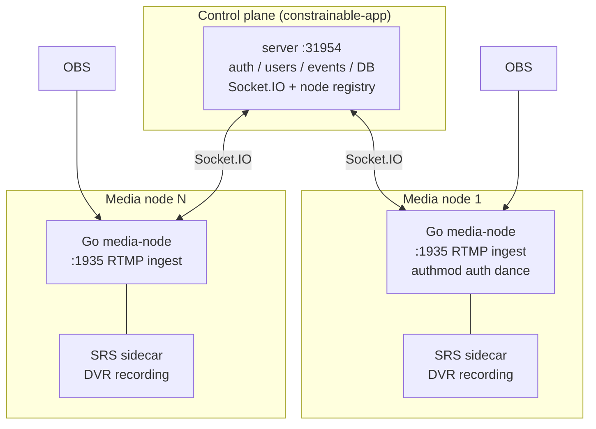

# constrainable-media-node

A distributed Go backend for RTMP ingest, video recording, and streaming. Each media-node pairs with an SRS sidecar container (this node owns the SRS config — template embedded, rendered to a shared volume at startup), fronts RTMP ingest with account authentication, records via SRS native DVR, and monitors via SRS HTTP API. No ffmpeg, no HTTP server — Socket.IO only.

Multiple media-nodes connect to one [constrainable-app](https://github.com/hnrobert/constrainable-app) control plane via Socket.IO, enabling horizontal scaling of ingest capacity.

## Architecture



## Configuration (environment)

| var | default | meaning |
| ----- | --------- | --------- |
| `API_ORIGIN` | `http://localhost:31954` | Control-plane (constrainable-app) URL — Socket.IO + auth |
| `PUBLIC_ORIGIN` | _(empty)_ | Browser-reachable base URL (e.g. `http://node1.example.com:38080`) — REQUIRED for multi-node deployments: drives per-user latency probing, the OBS ingest host of assigned users, and direct browser playback (signed URLs point at PUBLIC_ORIGIN). Empty in single-server deployments (users reach the node via the app's host). |
| `SELF_ORIGIN` | `localhost` | This node's public identifier (reported to Node) |
| `RTMP_PORT` | `1935` | RTMP ingest port (OBS pushes here) |
| `PLAY_PORT` | `38080` | Direct playback entry — browsers pull signed FLV URLs here; every pull is authorized by the control plane over Socket.IO (`play:auth`), then proxied from the SRS sidecar |
| `SRT_PORT` | `9000` | SRT ingest port (scaffold; not yet implemented) |
| `SRS_ADDR` | `srs:1935` | RTMP relay target (docker sidecar service name; `localhost:1935` for child-process SRS) |
| `SRS_FLV_BASE` | derived from `SELF_ORIGIN` + `SRS_HTTP_PORT` | FLV base ADVERTISED to the control plane (how the app backend pulls playback) — set to the SRS sidecar's service name on a shared network, e.g. `http://srs:38081` |
| `SRS_API_BASE` | `http://srs:1985/api/v1` | SRS HTTP API base (docker sidecar service name; use `http://localhost:1985/api/v1` when SRS runs as a child process via `SRS_BIN`) |
| `SRS_HTTP_PORT` | `38081` | SRS sidecar http_server port — INTERNAL only, never published (the node's play port proxies it); rendered into the config and used for the `SRS_FLV_BASE` default |
| `RECORD_DIR` | `./records` | Local MKV segment storage |
| `FFMPEG_PATH` | `ffmpeg` | ffmpeg binary path |
| `FFPROBE_PATH` | `ffprobe` | ffprobe binary path |
| `MEDIA_NODE_AUTH_TOKEN` | _(required)_ | Shared secret with the Node control plane |
| `ALLOW_DIRECT_SRS` | `false` | Accept publishers bypassing the RTMP front-door |
| `HOSTNAME_OVERRIDE` | _(hostname)_ | Human-readable node name |

## No HTTP server

The node's only HTTP interface is the play entry (:38080 PLAY_PORT — signed URLs, auth-gated via the control plane). Everything else rides the Socket.IO connection (auth, publish lifecycle, metrics, recording reports, commands). The SRS sidecar (:38081 FLV, :1985 API) is internal-only — browsers never reach it directly, so on a shared Docker network neither of its ports needs publishing.

## Socket.IO protocol (Phase 2)

Connects to Node's `/media-nodes` namespace with `{token: MEDIA_NODE_AUTH_TOKEN}`.

**Go → Node:**

- `node:register` `{origin, rtmpPort, srtPort, hostname, version}` → ack `{nodeId}`
- `publish:start` → ack `{allow, reason, sessionId, eventId, limits, record}`
- `publish:metrics` `{sessionId, width, height, fps, bitrateKbps}`
- `publish:end` `{sessionId, endedAt, durationSec}`
- `recording:ready` `{nodeId, streamName, eventId, segments[], ...}`
- `violation` `{sessionId, reasons[], metrics}`

**Node → Go:**

- `node:kick` `{streamName, reason}`
- `recording:delete` `{recordingId, segments[]}`
- `config:limits` `{global, events:[]}`

## Run (dev)

```bash
MEDIA_NODE_AUTH_TOKEN=dev-token \
API_ORIGIN=http://localhost:31954 \
SELF_ORIGIN=localhost \
go run .
```

## Test

```bash
go test ./...
```

## Docker

The image bundles: Go binary + SRS + ffmpeg. One container = one media node.

```bash
docker build -t media-node .
docker compose up -d  # runs the node + its SRS sidecar (see docker-compose.yml)
```
